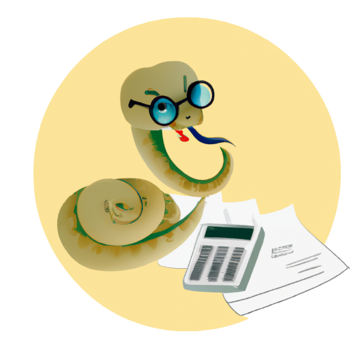

<h1 align="center">
Portali in sistemi znanja 2023/2024    
</h1>

## Dodatno gradivo za predmet Portali in sistemi znanja

## Namestitev Pythona in IDE-ja 

[Podrobna navodila za Windows](./podrobna-navodila/WINDOWS.md)  
[Podrobna navodila za Linux](./podrobna-navodila/LINUX.md)

## Literatura

[1] S. Karakatič and I. Fister ml., Strojno učenje: S Pythonom do prvega klasifikatorja, 1st ed. Maribor, Slovenia: University of Maribor Press, 2022. doi: [10.18690/um.feri.1.2022](https://doi.org/10.18690/um.feri.1.2022).

[2] J. Brownlee, “Machine Learning Mastery,” 2022. https://machinelearningmastery.com/ (accessed Oct. 03, 2022).

[3]G. Xu, Y. Zong, and Z. Yang, Applied Data Mining, 1st ed. Boca Raton, Florida, USA: CRC Press, 2013. doi: [10.1201/b15027](https://doi.org/10.1201/b15027).

[4] G. Vrbančič, L. Brezočnik, U. Mlakar, D. Fister, and I. Fister Jr., “NiaPy: Python microframework for building nature-inspired algorithms,” J. Open Source Softw., vol. 3, no. 23, p. 613, Mar. 2018, doi: [10.21105/joss.00613](https://doi.org/10.21105/joss.00613).

[5] A. P. Engelbrecht, Computational Intelligence, Second edi. Chichester, UK: John Wiley & Sons, Ltd, 2007. doi: [10.1002/9780470512517](https://doi.org/10.1002/9780470512517).

## Povezave do dokumentacije knjižnic

[1] [NiaPy](https://niapy.org/)

[2] [scikit-learn](https://scikit-learn.org/stable/)

[3] [NiaAML](https://github.com/lukapecnik/NiaAML#readme)

[4] [pandas](https://pandas.pydata.org/docs/user_guide/index.html#user-guide)

[5] [seaborn](https://seaborn.pydata.org/)

[6] [NumPy](https://numpy.org/)

[7] [Matplotlib](https://matplotlib.org/)

Shield: [![CC BY-SA 4.0][cc-by-sa-shield]][cc-by-sa]

Material in this folder is licensed under a
[Creative Commons Attribution-ShareAlike 4.0 International License][cc-by-sa].

[![CC BY-SA 4.0][cc-by-sa-image]][cc-by-sa]

[cc-by-sa]: http://creativecommons.org/licenses/by-sa/4.0/
[cc-by-sa-image]: https://licensebuttons.net/l/by-sa/4.0/88x31.png
[cc-by-sa-shield]: https://img.shields.io/badge/License-CC%20BY--SA%204.0-lightgrey.svg
