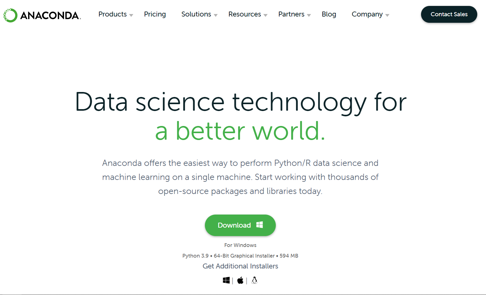
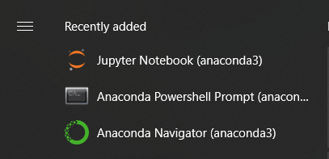
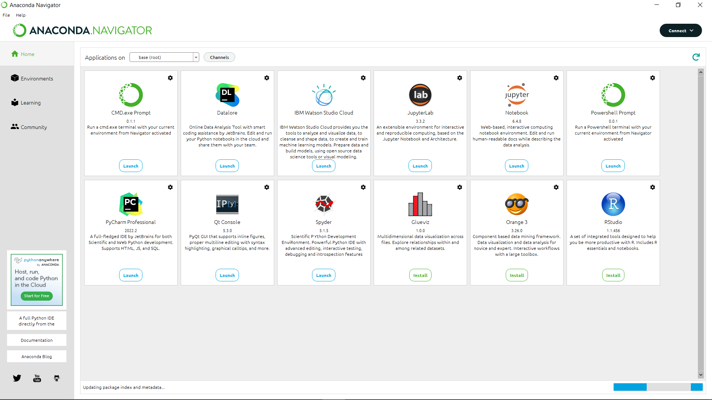
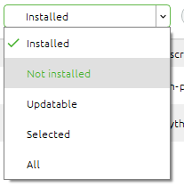
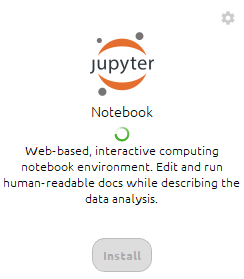
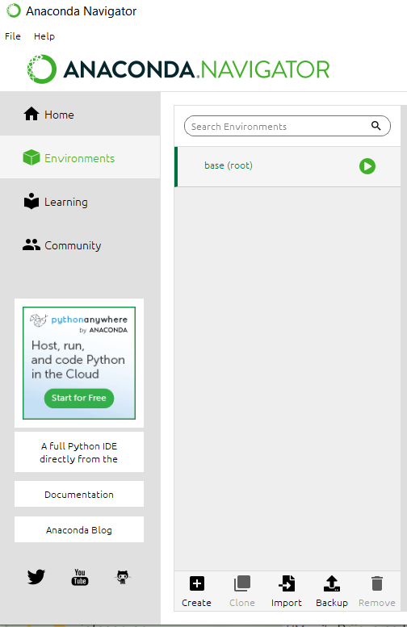
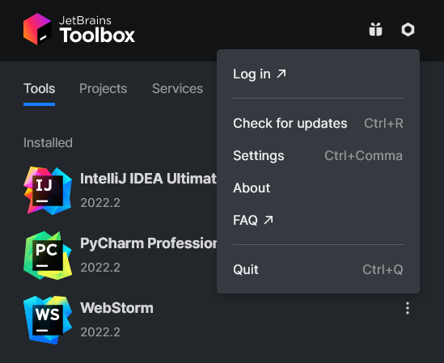
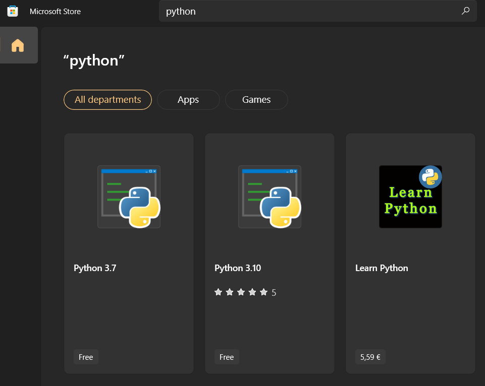

# Podrobnejša navodila za namestitev Pythona oziroma orodij za delo z njim
Pozornost je treba tudi posvetiti temu, kaj želimo s Pythonom početi. Za same python skripte (\*.py) bolj potrebujemo IDE. Za Delovne zvezke Jupyter (\*.ipynb) je najbolj pogosto orodje kar brskalnik. Običajno IDE-ji npr. PyCharm) sicer podpirajo oboje.
## Anaconda
Povlečemo si namestitveni paket

Namestitmo program, pri čemer smo zelo pozorni da naslednji možnosti ostaneta takšni, kot sta privzeto. 
.png)
Iz Start Menija zaženemo *Anaconda Navigator*

Sedaj imamo na izbiro veliko orodij za delo s Pythonom. Najbolj pogost / priporočen je **Jupyter Notebook**

### Anaconda dodajanje programskih knjižnic
**Dodatno** lahko iz menija na levi ustvarjamo virtualne namestitve jezika Python in v njih **nameščamo željene programske knjižnice**. Potrebno je biti pozoren, saj privzet filter kaže le že nameščene.

## Jupyter Notebook
Če Jupyter Notebook ni privzeto nameščen, samo pritisnemo na gumb *Install*

Ko ga zaženemo, se nam odpre privzet spletni brskalnik in naslov (privzeto) http://localhost:8888/ 

### Vzpostavitev okolja - Anaconda virtual environment
**Čeprav conda ustvari svoj "base" virtualenv**, je smiselno ustvariti svoejga, saj lahko pri programskem jeziku Python akr hitro nastopjio problemi z različnimi verzijami programskih knjižnic. 

S pritiskom na gumb "**Create**" nam ustvari kopijo osnovnega environmenta, skupaj z vsemi osnovnimi programskimi knjižnicami, ki se najbolj pogosto uporabljajo.

## ToolBox

Za začetek je priporočena ustvaritev računa in obisk strani, da si aktiviramo licenco: https://account.jetbrains.com/licenses 
Sam *ToolBox* je dosegljiv na spletni strani: https://www.jetbrains.com/toolbox-app/.

Nadaljevanje je preprosto, desno zgoraj kliknemo na kolešček in Log in. Preusmeri nas na spletno stran, po uspešnem vpisu je licenca za vsa orodja aktivirana.

**Bonus:** Na vrhu ima tudi *Projects*, s katerim lahko direktno odpremo poljuben projekt iz **git** v izbranem IDE-ju.

## PyCharm
Opcija 1 - **Toolbox**

Pod *Available* izberemo *PyCharm Professional*, ko se namesti se bo pojavil na vrhu pod *Installed*. Samo pritisnemo nanj in že se odpre. 

Opcija 2 - Direktna namestitev

Iz spletne strani https://www.jetbrains.com/pycharm/download/#section=windows prenesemo namestitveni paket. Pri tej opciji moramo po inštalaciji dodatno vpisati podatke za aktivacijo licence.

## Pure Python
Sam **Python** si lahko namestimo tudi s trgovine Microsoft Store. S tem lahko delamo direktno iz cmd/PowerShell (doda v Path). Dodamo ga lahko tudi kot osnovo v IDE, kot je PyCharm. 
