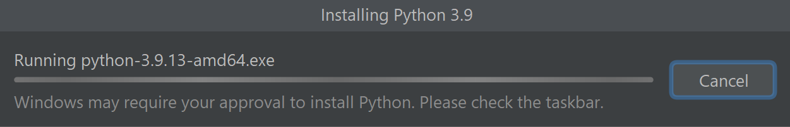
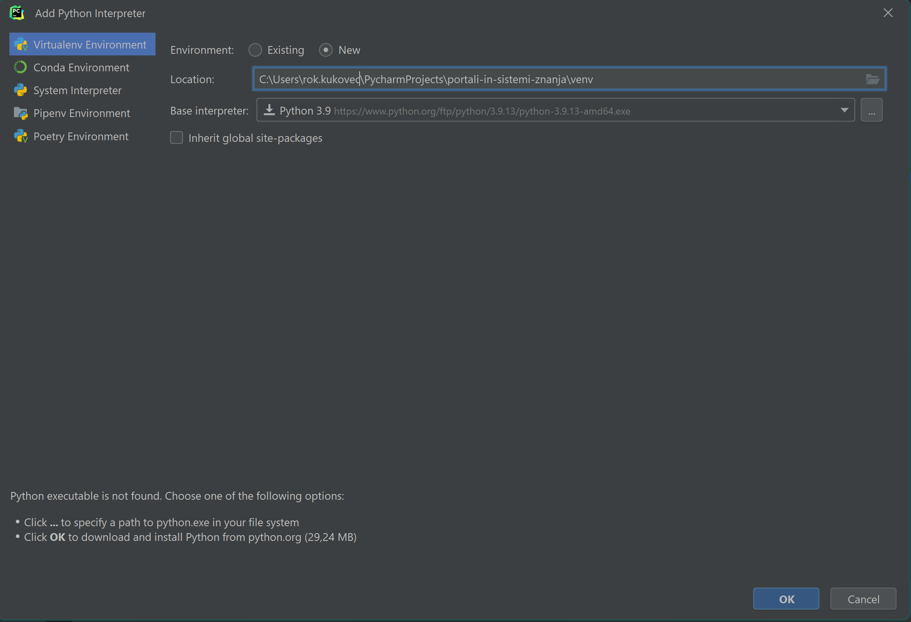

# Windows
Možnosti za namestitev programskega jezika je zelo veliko, nekaj izmed njih vključuje:
* https://www.anaconda.com/ (Anaconda, vzpostavitev okolja je iz Anaconda Prompt enaka kot pri Linux, iz Anaconda s pomočjo GUI, glej [Podrobna navodila za Windows](./podrobna-navodila/WINDOWS.md))
* https://www.python.org/downloads/windows/ (Samo Python - priporočena je zadnja verzija 3.x.x, trenutno je na voljo 3.10.7)
* PyCharm - JetBrains-ov IDE za Python 

Za uporabo JetBrains paketa je potrebna licenca. Pridobi se s pomočjo @student.um.si maila.
* https://account.jetbrains.com/licenses

Ob izbiri PyCharm-a se priporoča namestitev preko JetBrains ToolBox-a. Tako je lažje upravljati z večimi IDEji, licencami, posodobitvami, projekti...
* https://www.jetbrains.com/toolbox-app/ (namestitev IDE s pomočjo JetBrains ToolBox-a)
* https://www.jetbrains.com/pycharm/ (samo PyCharm IDE)

# Podrobnejša navodila za namestitev Pythona oziroma orodij za delo z njim
Pozornost je treba tudi posvetiti temu, kaj želimo s Pythonom početi. Za same python skripte (\*.py) bolj potrebujemo IDE. Za delovne zvezke Jupyter (\*.ipynb) je najbolj pogosto orodje kar brskalnik. Običajno IDE-ji (npr. PyCharm) sicer podpirajo oboje.

## Anaconda
Prenesemo si namestitveni paket


Namestitmo program, pri čemer smo zelo pozorni, da naslednji možnosti ostaneta takšni, kot sta privzeto. 

.png)

Iz Start Menija zaženemo *Anaconda Navigator*


Sedaj imamo na izbiro veliko orodij za delo s Pythonom. Najbolj pogost / priporočen je **Jupyter Notebook**


### Anaconda dodajanje programskih knjižnic
**Dodatno** lahko iz menija na levi ustvarjamo virtualne namestitve jezika Python in v njih **nameščamo željene programske knjižnice**. Potrebno je biti pozoren, saj privzet filter kaže le že nameščene.


## Jupyter Notebook
Če Jupyter Notebook ni privzeto nameščen, samo pritisnemo na gumb *Install*


Ko ga zaženemo, se nam odpre privzet spletni brskalnik in naslov (privzeto) http://localhost:8888/ 

### Vzpostavitev okolja - Anaconda virtual environment
**Čeprav conda ustvari svoj "base" virtualenv**, je smiselno ustvariti svoejga, saj lahko pri programskem jeziku Python kar hitro nastopjio problemi z različnimi verzijami programskih knjižnic.


S pritiskom na gumb "**Create**" nam ustvari kopijo osnovnega environmenta, skupaj z vsemi osnovnimi programskimi knjižnicami, ki se najbolj pogosto uporabljajo.

## ToolBox

Za začetek je priporočena ustvaritev računa in obisk strani, da si aktiviramo licenco: https://account.jetbrains.com/licenses 
Sam *ToolBox* je dosegljiv na spletni strani: https://www.jetbrains.com/toolbox-app/.

Nadaljevanje je preprosto, desno zgoraj kliknemo na kolešček in Log in. Preusmeri nas na spletno stran, po uspešnem vpisu je licenca za vsa orodja aktivirana.


**Bonus:** Na vrhu ima tudi *Projects*, s katerim lahko direktno odpremo poljuben projekt iz **git** v izbranem IDE-ju.

## PyCharm
Opcija 1 - **Toolbox**

Pod *Available* izberemo *PyCharm Professional*, ko se namesti se bo pojavil na vrhu pod *Installed*. Samo pritisnemo nanj in že se odpre. 

Opcija 2 - Direktna namestitev

Iz spletne strani https://www.jetbrains.com/pycharm/download/#section=windows prenesemo namestitveni paket. Pri tej opciji moramo po inštalaciji dodatno vpisati podatke za aktivacijo licence.

## Pure Python
Sam **Python** si lahko namestimo tudi s trgovine Microsoft Store. S tem lahko delamo direktno iz cmd/PowerShell (doda v Path). Dodamo ga lahko tudi kot osnovo v IDE, kot je PyCharm. 


## Odpiranje projekta iz diska

Še ena izmed možnosti je, da imamo projekt na disku (clone with git) in ga želimo odpreti v IDE-ju. To lahko storimo tako, da v PyCharmu kliknemo na *File* in nato na *Open...*.
Urejeni Python projekti običajno vsebujejo datoteko "requirements.txt", ki vsebuje vse potrebne knjižnice in njihove verzije. Če je datoteka prisotna, se nam bo v oknu za odpiranje projekta pokazala možnost *Install requirements*. 

* Ko odpremo projekt, samo potrdimo, da želimo ustvariti virtualno okolje in namestiti vse potrebne knjižnice.



* Desno spodaj, če "interpreter" še ni izbran, pritisnemo na "\<No interpreter\>". Iz requirements.txt se nam meni samodejno izpolni, samo pritisnemo na *OK*



## Poetry
### Namestitev Poetry
Če imate na sistemu nameščeno starejšo verzijo Python-a (<3.11), je za namestitev treba v PowerShell-u izvesti naslednji ukaz:
```bash
(Invoke-WebRequest -Uri https://install.python-poetry.org -UseBasicParsing).Content | python -
```
Če imate na sistemu nameščen Python 3.11, je za namestitev treba v PowerShell-u izvesti naslednji ukaz:
```bash
(Invoke-WebRequest -Uri https://install.python-poetry.org -UseBasicParsing).Content | py -
```
Namestitev lahko izvedete tudi s pomočjo pip3 ukaza:
```bash
pip3 install poetry
```
### Inicializacija projekta
Za inicializacijo projekta se premaknemo v mapo, kjer želimo inicializirati projekt, in izvedemo ukaz:
```bash
poetry init
```
Po izvedbi ukaza nam ukazna vrstica ponudi interaktiven vmesnik za vnos podatkov o projektu.
### Delo s paketi
Za nameščanje paketov se premaknemo v mapo, kjer je inicializiran projekt, in izvedemo ukaz:
```bash
poetry add ime_paketa
```
Za odstranjevanje paketov se premaknemo v mapo, kjer je inicializiran projekt, in izvedemo ukaz:
```bash
poetry remove ime_paketa
```
### Odstranitev Poetry
Če ste Poetry namestili s pomočjo prvih dveh ukazov, je za odstranitev najprej treba nastaviti okoljsko spremenljivko ``POETRY_UNINSTALL=1``:
```bash
set POETRY_UNINSTALL=1
```
Če imate na sistemu nameščeno starejšo verzijo Python-a (<3.11), je za odstranitev treba izvesti naslednji ukaz:
```bash
curl -sSL https://install.python-poetry.org | python -
```
Če imate na sistemu nameščen Python 3.11, je za odstranitev treba izvesti naslednji ukaz:
```bash
curl -sSL https://install.python-poetry.org | py -
```
Če ste za namestitev uporabili pip3 ukaz, je za odstranitev treba izvesti naslednji ukaz:
```bash
pip3 uninstall poetry
```
