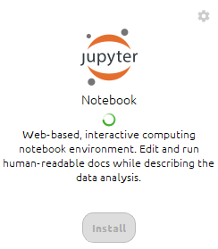
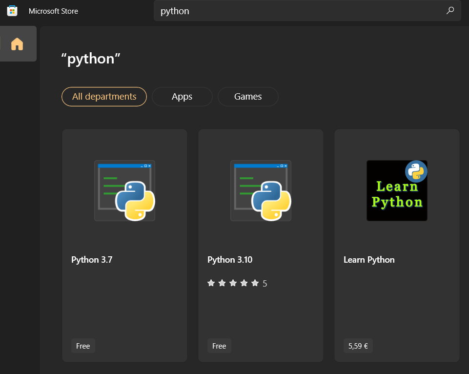

# Windows
Možnosti za namestitev programskega jezika je zelo veliko, nekaj izmed njih vključuje:
* Anaconda
    * [https://www.anaconda.com](https://www.anaconda.com)
    * Vzpostavitev okolja iz Anaconda Prompt je enaka kot pri Linux.
    * Za vzpostavitev okolja s pomočjo Anaconda GUI glej [Podrobna navodila za Windows](./podrobna-navodila/WINDOWS.md).
* Python
    * [https://www.python.org/downloads/windows](https://www.python.org/downloads/windows)
    * Priporočena je zadnja verzija 3.x.x, trenutno je na voljo 3.10.7.
* PyCharm
    * https://www.jetbrains.com/pycharm
    * JetBrains-ov IDE za Python.
    * Za uporabo JetBrains paketa je potrebna licenca, ki se pridobi s pomočjo @student.um.si.
        * https://account.jetbrains.com/licenses
    * Ob izbiri PyCharm-a se priporoča namestitev preko JetBrains ToolBox. Tako je lažje upravljati z več IDE-ji, licencami, posodobitvami in projekti.
        * https://www.jetbrains.com/toolbox-app

# Podrobnejša navodila za namestitev Pythona oziroma orodij za delo z njim
Pozornost je treba tudi posvetiti temu, kaj želimo s Python-om početi. Za Python skripte (\*.py) potrebujemo IDE. Za delovne zvezke Jupyter (\*.ipynb) je najbolj pogosto orodje kar brskalnik. Običajno IDE-ji (npr. PyCharm) podpirajo oboje.

## Anaconda
Najprej si prenesemo namestitveni paket.


Nato namestimo program, pri čemer smo zelo pozorni, da naslednji možnosti ostaneta takšni, kot sta privzeto. 

.png)

Iz Start Menija zaženemo *Anaconda Navigator*.


Sedaj imamo na izbiro veliko orodij za delo s Pythonom. Najbolj pogost / priporočen je **Jupyter Notebook**.


### Dodajanje programskih knjižnic
**Dodatno** lahko iz menija na levi ustvarjamo virtualne namestitve jezika Python in vanje **nameščamo želene programske knjižnice**. Potrebno je biti pozoren, saj privzet filter kaže le že nameščene.


## Jupyter Notebook
Če Jupyter Notebook ni privzeto nameščen, samo pritisnemo na gumb *Install*.



Ko ga zaženemo, se na privzetem spletnem brskalniku privzeto odpre naslov http://localhost:8888. 

### Vzpostavitev okolja - Anaconda virtual environment
**Čeprav conda ustvari svoj "base" virtualenv**, je smiselno ustvariti svojega, saj lahko pri programskem jeziku Python hitro nastopijo problemi z različnimi verzijami programskih knjižnic. 


S pritiskom na gumb "**Create**" nam ustvari kopijo osnovnega okolja, skupaj z vsemi osnovnimi programskimi knjižnicami, ki se najbolj pogosto uporabljajo.

## ToolBox

Za začetek je priporočena ustvaritev računa in obisk strani (https://account.jetbrains.com/licenses), da si aktiviramo licenco. 

Sam *ToolBox* je dosegljiv na spletni strani: https://www.jetbrains.com/toolbox-app.

Nadaljevanje je preprosto. Desno zgoraj kliknemo na kolešček in izberemo "Log in". Stran nas nato preusmeri na spletno stran, kjer se lahko vpišemo. Po uspešnem vpisu je licenca aktivirana za vsa orodja.


**Bonus:** Na vrhu ima tudi *Projects*, s katerim lahko neposredno odpremo poljuben projekt iz **git** v izbranem IDE-ju.

## PyCharm
Opcija 1 - **Toolbox**

Pod *Available* izberemo *PyCharm Professional*. Ko se namesti, se bo pojavil na vrhu pod *Installed*. Samo pritisnemo nanj in že se odpre. 

Opcija 2 - Neposredna namestitev

Iz spletne strani (https://www.jetbrains.com/pycharm/download/#section=windows) prenesemo namestitveni paket. Pri tej opciji moramo po inštalaciji dodatno vpisati podatke za aktivacijo licence.

## Pure Python
Sam **Python** si lahko namestimo tudi iz trgovine Microsoft Store. S tem lahko delamo neposredno iz cmd/PowerShell (samodejno se doda v Path). Dodamo ga lahko tudi kot osnovo v IDE, kot je PyCharm. 



## Odpiranje projekta iz diska

Še ena izmed možnosti je, da imamo projekt na disku (clone with git) in ga želimo odpreti v IDE-ju. To lahko storimo tako, da v PyCharmu kliknemo na *File* in nato na *Open...*.

Urejeni Python projekti običajno vsebujejo datoteko "requirements.txt", ki vsebuje vse potrebne knjižnice in njihove verzije. Če je datoteka prisotna, se nam bo v oknu za odpiranje projekta pokazala možnost *Install requirements*. 

* Ko odpremo projekt, potrdimo, da želimo ustvariti virtualno okolje in namestiti vse potrebne knjižnice.


* Če "interpreter" še ni izbran, desno spodaj pritisnemo na "\<No interpreter\>". Iz requirements.txt se meni samodejno izpolni. Nato je treba pritisniti na *OK*.


## Poetry
### Namestitev Poetry
Če imate na sistemu nameščeno starejšo verzijo Python-a (<3.11), je za namestitev treba v PowerShell-u izvesti naslednji ukaz:
```bash
(Invoke-WebRequest -Uri https://install.python-poetry.org -UseBasicParsing).Content | python -
```
Če imate na sistemu nameščen Python 3.11, je za namestitev treba v PowerShell-u izvesti naslednji ukaz:
```bash
(Invoke-WebRequest -Uri https://install.python-poetry.org -UseBasicParsing).Content | py -
```
Namestitev lahko izvedete tudi s pomočjo pip3 ukaza:
```bash
pip3 install poetry
```
### Inicializacija projekta
Za inicializacijo projekta se premaknemo v mapo, kjer želimo inicializirati projekt, in izvedemo ukaz:
```bash
poetry init
```
Po izvedbi ukaza nam ukazna vrstica ponudi interaktiven vmesnik za vnos podatkov o projektu.
### Delo s paketi
Za nameščanje paketov se premaknemo v mapo, kjer je inicializiran projekt, in izvedemo ukaz:
```bash
poetry add ime_paketa
```
Za odstranjevanje paketov se premaknemo v mapo, kjer je inicializiran projekt, in izvedemo ukaz:
```bash
poetry remove ime_paketa
```
### Odstranitev Poetry
Če ste Poetry namestili s pomočjo prvih dveh ukazov, je za odstranitev najprej treba nastaviti okoljsko spremenljivko ``POETRY_UNINSTALL=1``:
```bash
set POETRY_UNINSTALL=1
```
Če imate na sistemu nameščeno starejšo verzijo Python-a (<3.11), je za odstranitev treba izvesti naslednji ukaz:
```bash
curl -sSL https://install.python-poetry.org | python -
```
Če imate na sistemu nameščen Python 3.11, je za odstranitev treba izvesti naslednji ukaz:
```bash
curl -sSL https://install.python-poetry.org | py -
```
Če ste za namestitev uporabili pip3 ukaz, je za odstranitev treba izvesti naslednji ukaz:
```bash
pip3 uninstall poetry
```